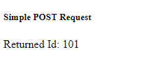

# fetch

## Contents

- [fetch](#fetch)
  - [Contents](#contents)
  - [Introduction](#introduction)
    - [API Post Using Javascript Fetch](#api-post-using-javascript-fetch)
    - [API Post Using Javascript Fetch With Async..Await](#api-post-using-javascript-fetch-with-asyncawait)
    - [API Post To Invalid URL with Error Handling](#api-post-to-invalid-url-with-error-handling)


## Introduction

These are a few notes on Javascript fetch()

### [API Post Using Javascript Fetch](single-files\api-post-01-using-fetch.html)

This tutorial is from Jason Watmore at JasonWatmore.com (https://jasonwatmore.com/post/2020/04/30/vue-fetch-http-post-request-examples) so many thanks [@jason_watmore](https://twitter.com/jason_watmore?lang=en).  

The example I am using is from this page

https://jasonwatmore.com/post/2020/04/30/vue-fetch-http-post-request-examples

with this live preview

https://codesandbox.io/s/vue-fetch-http-post-request-examples-4i038?file=/app/PostRequest.vue

I have modified the code just to run in a single html file, but it works.

It simply returns an Id of 101 after posting to the sample API



```html
<!DOCTYPE html>
<html lang="en">
<head>
    <meta charset="UTF-8">
    <meta name="viewport" content="width=device-width, initial-scale=1.0">
    <meta http-equiv="X-UA-Compatible" content="ie=edge">
    <script src="https://unpkg.com/vue@2.5.16/dist/vue.js"></script>
    <title>Vue Post To API using Javascript Fetch</title>
</head>
<body>
<div id="app">
    <div class="card text-center m-3">
        <h5 class="card-header">Simple POST Request</h5>
        <div class="card-body">Returned Id: {{postId}}</div>
    </div>
</div>
<script>
var app = new Vue({
    el:'#app',
    name: "post-request",
    data() {
        return {
        postId: null
        };
    },
    created() {
        // Simple POST request with a JSON body using fetch
        const requestOptions = {
            method: "POST",
            headers: { "Content-Type": "application/json" },
            body: JSON.stringify({ title: "Vue POST Request Example" })
        };
        fetch("https://jsonplaceholder.typicode.com/posts", requestOptions)
        .then(response => response.json())
        .then(data => (this.postId = data.id));
    }
})    
</script>
</body>
</html>
```


### [API Post Using Javascript Fetch With Async..Await](single-files\api-post-02-using-fetch-async.html)

This is also from Jason Watmore so again thanks [@jason_watmore](https://twitter.com/jason_watmore?lang=en)

```html
<!DOCTYPE html>
<html lang="en">
<head>
    <meta charset="UTF-8">
    <meta name="viewport" content="width=device-width, initial-scale=1.0">
    <meta http-equiv="X-UA-Compatible" content="ie=edge">
    <script src="https://unpkg.com/vue@2.5.16/dist/vue.js"></script>
    <title>Vue Post To API using Javascript Fetch</title>
</head>
<body>
<div id="app">
    <div class="card text-center m-3">
        <h5 class="card-header">POST Request with Async/Await</h5>
        <div class="card-body">Returned Id: {{postId}}</div>
        <div class="stopwatch">Time Taken For Retrieval: {{timeTakenToRetrieveData}} milliseconds</div>
      </div>
</div>
<script>
var app = new Vue({
    el:'#app',
    name: "post-request-async-await",
    data() {
        return {
        postId: null,
        timeTakenToRetrieveData: 0
        };
    },
    async created() {
        // POST request using fetch with async/await
        var startTime = new Date()
        const requestOptions = {
            method: "POST",
            headers: { "Content-Type": "application/json" },
            body: JSON.stringify({ title: "Vue POST Request Example" })
        };
        const response = await fetch("https://jsonplaceholder.typicode.com/posts", requestOptions);
        const data = await response.json();
        this.postId = data.id;
        var endTime = new Date()
        this.timeTakenToRetrieveData = endTime-startTime
    }
})    
</script>
</body>
</html>
```

### [API Post To Invalid URL with Error Handling](single-files\api-post-03-fetch-async-with-error.html)

This just shows how to handle the code with errors

```html
<!DOCTYPE html>
<html lang="en">
<head>
    <meta charset="UTF-8">
    <meta name="viewport" content="width=device-width, initial-scale=1.0">
    <meta http-equiv="X-UA-Compatible" content="ie=edge">
    <script src="https://unpkg.com/vue@2.5.16/dist/vue.js"></script>
    <title>Vue Post To API using Javascript Fetch</title>
</head>
<body>
<div id="app">
    <div class="card text-center m-3">
        <h5 class="card-header">POST Request with Async/Await</h5>
        <div class="card-body">Returned Id: {{postId}}</div>
        <div class="error-message">{{errorMessage}}</div>
        <div class="stopwatch">Time Taken For Retrieval: {{timeTakenToRetrieveData}} milliseconds</div>
      </div>
</div>
<script>
var app = new Vue({
    el:'#app',
    name: "post-request-async-await",
    data() {
        return {
        postId: null,
        timeTakenToRetrieveData: 0,
        errorMessage:null
        };
    },
    async created() {
        // POST request using fetch with async/await
        var startTime = new Date()
        const requestOptions = {
            method: "POST",
            headers: { "Content-Type": "application/json" },
            body: JSON.stringify({ title: "Vue POST Request Example" })
        };
        fetch("https://jsonplaceholder.typicode.com/posts-invalid", requestOptions)
            .then(async response => {
                const data = await response.json();
                if(!response.ok){
                    const error = (data && data.message) || response.status
                    return Promise.reject(error)
                }
                this.postId = data.id;
                var endTime = new Date()
                this.timeTakenToRetrieveData = endTime-startTime
            })
            .catch(error => {
                this.errorMessage = `Error Retrieving Data - ${error}`
                this.postId='N/A'
                this.timeTakenToRetrieveData='N/A'
                console.error('Error retrieving data - ', error)
        })
    }
})    
</script>
<style>
    .error-message{
        color:red;
    }
</style>
</body>
</html>
```

